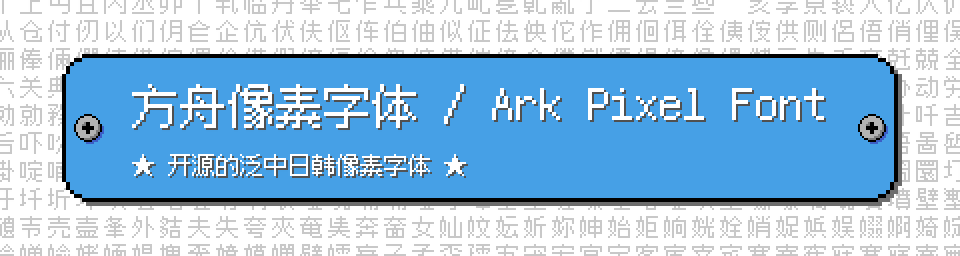

# 方舟像素字体 / Ark Pixel Font

[](https://scripts.sil.org/OFL)
[](https://opensource.org/licenses/MIT)
[](https://github.com/TakWolf/ark-pixel-font/releases)

开源的中日韩文像素字体。等宽，支持 10、12 和 16 像素尺寸。

这个项目不仅提供了全部的字形设计源文件，也提供了构建字体所需要的完整程序。

## 预览

- 10 像素


- 12 像素


- 16 像素


## 字符统计

- [10 像素](docs/font-info-10px.md)
- [12 像素](docs/font-info-12px.md)
- [16 像素](docs/font-info-16px.md)

## 特定语言区域变种

不同的语言区域，由于规范和书写习惯不同，同一个字符，字形可能存在差别。

本字体目前支持五个特定语言区域变种，分别为：

| 标识 | 语言区域 |
|---|---|
| zh_cn | 中文-中国大陆 |
| zh_hk | 中文-香港特别行政区 |
| zh_tw | 中文-台湾地区 |
| ja | 日语 |
| ko | 朝鲜语 |

这些差异，主要集中在部分汉字和标点符号上。拉丁字母、特殊符号等通常没有差别。

## 下载和使用

可在 [Releases](https://github.com/TakWolf/ark-pixel-font/releases) 下载最新的版本。

目前提供三种字体格式：

| 格式 | 使用场景 |
|---|---|
| `.otf` | 新一代主流字体格式，可以直接用于操作系统、设计软件或游戏引擎。推荐优先使用这个格式。 |
| `.ttf` | 在 `.otf` 出现之前的主流字体格式，理论上可以被 `.otf` 完全取代。如果你的软件不支持 `.otf` 格式，请使用这个格式。 |
| `.woff2` | 压缩后的 `.otf` 格式，体积更小，适用于网络传输，但并非所有软件都支持。如果你需要通过网页在线引用字体，请优先使用这个格式。 |

## 工作流程

本字体采用程序的方式来构建。这要得益于 [FontTools](https://github.com/fonttools/fonttools) 提供了强大的字体处理工具。

字形的设计源文件是 PNG 图片格式，它们位于 [assets/design](assets/design) 目录下，按照 16 进制 Unicode 编号来命名。
通常使用 [Aseprite](https://github.com/aseprite/aseprite) 等绘图工具来绘制字形。

程序上读取这些图片文件，根据透明度值转化为二维点阵数据，然后转换为轮廓数据，最后绘制字符生成字体。

## 本地构建

计算机中需要安装 [Python3](https://www.python.org/) 和 [virtualenv](https://github.com/pypa/virtualenv) 环境。

打开终端，通过 `git` 命令克隆项目：

```commandline
git clone https://github.com/TakWolf/ark-pixel-font.git
```

进入项目文件夹，并创建虚拟环境：

```commandline
cd ark-pixel-font
virtualenv venv
source ./venv/bin/activate
```

安装所需依赖：

```commandline
python -m pip install -r requirements.txt
```

执行构建脚本：

```
python ./build.py
```

等待执行完毕后，可在 `outputs` 目录下找到生成的字体文件。

## 授权信息

本项目包含「字体」和「构建程序」两个部分。

### 字体

使用 [SIL 开放字体许可证 第1.1版（SIL Open Font License 1.1）](LICENSE-OFL) 授权，保留字体名称「方舟像素 / Ark Pixel」。

简单来说：

- 您可以免费使用字体，包括商业用途，无需告知作者或标明出处。
- 您可以将字体与任何软件捆绑再分发／销售，但禁止单独销售字体文件。
- 您可以自由修改、制作衍生字体，但必须使用同样的许可证分发，且不能使用保留的字体名称。
- 您不能使用这款字体用于违法行为。如因使用字体产生纠纷或法律诉讼，作者不承担任何责任。

### 构建程序

使用 [MIT 许可证](LICENSE-MIT) 授权。

 ## 参与改进

任何有关字体和程序上的建议，都欢迎创建 [Issues](https://github.com/TakWolf/ark-pixel-font/issues) 来反馈，也可以通过 [Discussions](https://github.com/TakWolf/ark-pixel-font/discussions) 来讨论。

## 相关页面

- [项目主页](https://ark-pixel-font.takwolf.com)
- [itch.io](https://takwolf.itch.io/ark-pixel-font)

## 赞助

- [爱发电](https://afdian.net/@takwolf)

## 参考资料

- [FontTools](https://github.com/fonttools/fonttools)
- [Aseprite](https://github.com/aseprite/aseprite)
- [Font Development Best Practices](http://silnrsi.github.io/FDBP/)
- [Microsoft - OpenType font documentation](https://docs.microsoft.com/en-us/typography/opentype/)
- [Unicode 字符百科](https://unicode-table.com/)
