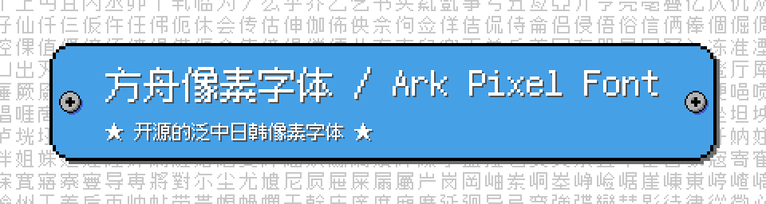

# 方舟像素字体 / Ark Pixel Font

[](https://scripts.sil.org/OFL)
[](https://opensource.org/licenses/MIT)
[](https://github.com/TakWolf/ark-pixel-font/releases)
[](https://discord.gg/XZkTuwuGpC)

- [主页](https://ark-pixel-font.takwolf.com)
- [itch.io](https://takwolf.itch.io/ark-pixel-font)
- [Discord](https://discord.gg/XZkTuwuGpC)

开源的泛中日韩像素字体。支持 10、12 和 16 像素。目标是为像素风格的游戏开发提供一套可用于正文的开箱即用的字体解决方案。

这个项目不仅提供了全部的字形设计源文件，也提供了构建字体所需要的完整程序。

## 预览

可以通过 [Playground](https://ark-pixel-font.takwolf.com/playground.html) 在线实时预览字体样式。

### 10 像素


[示例文本](https://ark-pixel-font.takwolf.com/demo-10px.html)

[字符表](https://ark-pixel-font.takwolf.com/alphabet-10px.html)

[字符统计](docs/font-info-10px.md)

### 12 像素


[示例文本](https://ark-pixel-font.takwolf.com/demo-12px.html)

[字符表](https://ark-pixel-font.takwolf.com/alphabet-12px.html)

[字符统计](docs/font-info-12px.md)

### 16 像素


[示例文本](https://ark-pixel-font.takwolf.com/demo-16px.html)

[字符表](https://ark-pixel-font.takwolf.com/alphabet-16px.html)

[字符统计](docs/font-info-16px.md)

## 特定语言字形

不同国家或地区，由于规范或书写习惯不同，同一个字符，字形可能存在差别。

目前支持以下特定语言字形，分别为：

| 标识 | 含义 | 备注 |
|---|---|---|
| latin | 拉丁语 | 在非中日韩环境下使用，标点符号采用英语或欧洲语言习惯。 |
| zh_cn | 中文-中国大陆 | |
| zh_hk | 中文-香港特别行政区 | |
| zh_tw | 中文-台湾地区 | |
| zh_tr | 中文-传统印刷 | 字形采用传统印刷体写法（也称 [舊字形](https://zh.wikipedia.org/wiki/%E8%88%8A%E5%AD%97%E5%BD%A2) ），符合香港和台湾地区传统使用习惯。 |
| ja | 日语 | |
| ko | 朝鲜语 | |

## 下载和使用

可在 [Releases](https://github.com/TakWolf/ark-pixel-font/releases) 下载最新的版本。

目前提供三种字体格式：

| 格式 | 使用场景 |
|---|---|
| `.otf` | 新一代主流字体格式，可以直接用于操作系统、设计软件或游戏引擎。推荐优先使用这个格式。 |
| `.ttf` | 在 `.otf` 出现之前的主流字体格式，理论上可以被 `.otf` 完全取代。如果你的软件不支持 `.otf` 格式，请使用这个格式。 |
| `.woff2` | 压缩后的 `.otf` 格式，体积更小，适用于网络传输，但并非所有软件都支持。如果你需要通过网页在线引用字体，请优先使用这个格式。 |

## 开发流程

本字体使用程序进行构建。

字形的设计源文件是 PNG 格式的图片，它们位于 [assets/design](assets/design) 目录下，按照 16 进制 Unicode 编号来命名。

程序读取这些图片，根据透明度值进行二值化，转化为二维点阵数据。然后生成轮廓数据，绘制字形并生成字体文件。

## 本地构建

如果您需要对字体做定制化处理（例如制作子集版本），可以通过如下方式在本地构建字体：

计算机中需要安装 [Python3](https://www.python.org/) 和 [virtualenv](https://github.com/pypa/virtualenv) 环境。

打开终端，通过 `git` 命令克隆项目：

```commandline
git clone https://github.com/TakWolf/ark-pixel-font.git
```

进入项目文件夹，并创建虚拟环境：

```commandline
cd ark-pixel-font
virtualenv venv
source ./venv/bin/activate
```

安装所需依赖：

```commandline
python -m pip install -r requirements.txt
```

执行构建脚本：

```
python ./build.py
```

等待执行完毕后，可在 `outputs` 目录下找到生成的字体文件。

## 参与改进

任何有关字体和程序上的建议，都欢迎创建 [Issues](https://github.com/TakWolf/ark-pixel-font/issues) 来反馈，也可以通过 [Discussions](https://github.com/TakWolf/ark-pixel-font/discussions) 来讨论。

此外，我们也有一个 [Discord](https://discord.gg/XZkTuwuGpC) 频道。

## 授权信息

本项目包含「字体」和「构建程序」两个部分。

### 字体

使用 [SIL 开放字体许可证 第1.1版（SIL Open Font License 1.1）](LICENSE-OFL) 授权，保留字体名称「方舟像素 / Ark Pixel」。

### 构建程序

使用 [MIT 许可证](LICENSE-MIT) 授权。

## 程序依赖

- [FontTools](https://github.com/fonttools/fonttools)
- [Brotli](https://github.com/google/brotli)
- [PyPNG](https://github.com/drj11/pypng)
- [Pillow](https://github.com/python-pillow/Pillow)
- [Beautiful Soup](https://www.crummy.com/software/BeautifulSoup/)
- [Soup Sieve](https://github.com/facelessuser/soupsieve)
- [Jinja](https://github.com/pallets/jinja)
- [MarkupSafe](https://github.com/pallets/markupsafe)
- [minify-html](https://github.com/wilsonzlin/minify-html)
- [GitPython](https://github.com/gitpython-developers/GitPython)
- [GitDB](https://github.com/gitpython-developers/gitdb)
- [Smmap](https://github.com/gitpython-developers/smmap)

## 外部工具

- [Aseprite](https://github.com/aseprite/aseprite)
- [Unicode 字符百科](https://unicode-table.com/)
- [字統网 - 字形檢字](https://zi.tools/?secondary=search)
- [字嗨 - 漢字部件檢索](https://zi-hi.com/sp/uni/CJKSeeker)
- [国学大师 - 汉字部件查字](http://www.guoxuedashi.net/zidian/bujian/)

## 参考资料

- [Font Development Best Practices](https://silnrsi.github.io/FDBP/)
- [Microsoft - OpenType font documentation](https://docs.microsoft.com/en-us/typography/opentype/)

## 赞助

如果「方舟像素字体」对您有帮助，请考虑赞助来支持开发工作。

- [收款码](https://github.com/TakWolf/TakWolf/blob/master/payment-qr-codes.md)
- [爱发电](https://afdian.net/@takwolf)

请务必备注「方舟像素字体」，这样才会被统计到该项目的赞助商列表中。

可以在下面的链接中查看该项目收到的具体赞助情况：

[方舟像素字体 - 赞助](https://github.com/TakWolf/TakWolf/blob/master/sponsors/ark-pixel-font.md)
