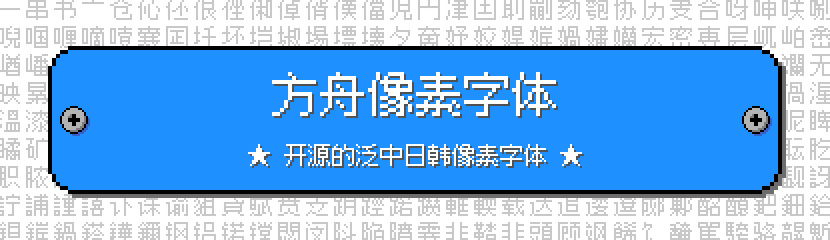
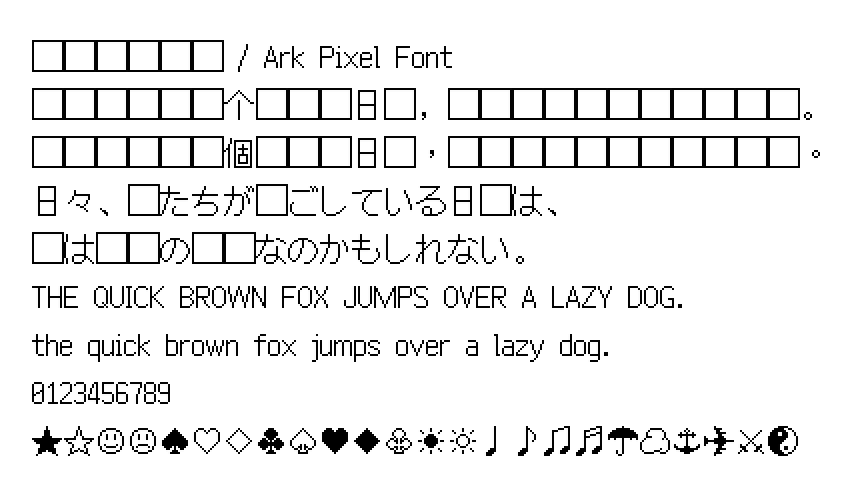

# 方舟像素字体 / Ark Pixel Font

[](https://scripts.sil.org/OFL)
[](https://opensource.org/licenses/MIT)
[](https://github.com/TakWolf/ark-pixel-font/releases)
[](https://discord.gg/3GKtPKtjdU)
[](https://jq.qq.com/?_wv=1027&k=EXtKGHar)

开源的泛中日韩像素字体。支持 10、12 和 16 像素。目标是为游戏开发提供一套可用于正文的开箱即用的像素字体解决方案。

这个项目不仅提供了全部的字形源文件，也提供了构建字体所需要的完整程序。

- [主页](https://ark-pixel-font.takwolf.com)
- [itch.io](https://takwolf.itch.io/ark-pixel-font)
- [Discord](https://discord.gg/3GKtPKtjdU)
- [QQ 群](https://jq.qq.com/?_wv=1027&k=EXtKGHar)

## 预览

可以通过 [Playground](https://ark-pixel-font.takwolf.com/playground.html) 实时预览字体效果。

### 10 像素


[示例文本](https://ark-pixel-font.takwolf.com/demo-10px.html)

[等宽模式-字母表](https://ark-pixel-font.takwolf.com/alphabet-10px-monospaced.html)

[比例模式-字母表](https://ark-pixel-font.takwolf.com/alphabet-10px-proportional.html)

### 12 像素


[示例文本](https://ark-pixel-font.takwolf.com/demo-12px.html)

[等宽模式-字母表](https://ark-pixel-font.takwolf.com/alphabet-12px-monospaced.html)

[比例模式-字母表](https://ark-pixel-font.takwolf.com/alphabet-12px-proportional.html)

### 16 像素



[示例文本](https://ark-pixel-font.takwolf.com/demo-16px.html)

[等宽模式-字母表](https://ark-pixel-font.takwolf.com/alphabet-16px-monospaced.html)

[比例模式-字母表](https://ark-pixel-font.takwolf.com/alphabet-16px-proportional.html)

## 字符统计

可以通过下面的链接来查看字体各尺寸目前支持的字符情况。

| 尺寸 | 等宽模式 | 比例模式 |
|---|---|---|
| 10px | [font-info-10px-monospaced](docs/font-info-10px-monospaced.md) | [font-info-10px-proportional](docs/font-info-10px-proportional.md) |
| 12px | [font-info-12px-monospaced](docs/font-info-12px-monospaced.md) | [font-info-12px-proportional](docs/font-info-12px-proportional.md) |
| 16px | [font-info-16px-monospaced](docs/font-info-16px-monospaced.md) | [font-info-16px-proportional](docs/font-info-16px-proportional.md) |

## 尺寸

目前支持 10、12 和 16 三个像素尺寸。

字体的 `UPM`（`Units Per Em`，每个字面框包含的单位数）按照像素尺寸的 100 倍来转化，即：`1 px = 100 units` 。

字体各尺寸的 `UPM` 值如下：

| 尺寸 | UPM |
|---|---|
| 10px | 1000 |
| 12px | 1200 |
| 16px | 1600 |

在渲染时，请将文本尺寸设置为对应字体的像素尺寸或其整数倍，以保证栅格化时能够精确地进行像素转化。

## 宽度模式

目前支持「等宽」和「比例」两种模式。

### 「等宽」模式

字符为全宽或半宽，排版时可严格对其。字形完全处于字面框内部，默认行高等于字体的像素尺寸。

但基线位置略微偏高，中西文混排时西文在视觉上重心偏高，美观性略差。

### 「比例」模式

字符宽度根据字形实际情况变化，基线处于合适的位置。纵向上字形可能会超出字面框，默认行高大于字体的像素尺寸。

该模式排版观感自然，如无特殊需求，你应该优先选择这个模式。

字体各尺寸的默认行高如下：

| 尺寸 | 行高 |
|---|---|
| 10px | 16px |
| 12px | 18px |
| 16px | 24px |

## 语言特定字形

不同国家或地区，由于规范或书写习惯不同，同一个字符，字形可能存在差别。这种情况大部分为汉字，少量为标点符号。

目前支持以下语言特定字形版本：

| 版本 | 含义 | 说明 |
|---|---|---|
| latin | 拉丁语 | 在非中日韩环境下使用，标点符号采用西文习惯写法。 |
| zh_cn | 中文-中国大陆 | 字形采用中国大陆地区标准规范 [《通用规范汉字表》](https://www.moe.gov.cn/jyb_sjzl/ziliao/A19/201306/t20130601_186002.html) 中的写法。 |
| zh_hk | 中文-香港特别行政区 | 字形采用香港地区教育规范 [《常用字字形表》](https://zh.wikipedia.org/wiki/%E5%B8%B8%E7%94%A8%E5%AD%97%E5%AD%97%E5%BD%A2%E8%A1%A8) 中的写法。 |
| zh_tw | 中文-台湾地区 | 字形采用台湾地区教育规范 [《国字标准字体》](https://zh.wikipedia.org/wiki/%E5%9C%8B%E5%AD%97%E6%A8%99%E6%BA%96%E5%AD%97%E9%AB%94) 中的写法。 |
| zh_tr | 中文-传统印刷 | 字形采用 [传统印刷体](https://zh.wikipedia.org/wiki/%E8%88%8A%E5%AD%97%E5%BD%A2) 写法，符合香港和台湾地区传统使用习惯。 |
| ja | 日语 | 字形采用日本参考规范 [《常用汉字表》](https://zh.wikipedia.org/wiki/%E5%B8%B8%E7%94%A8%E6%BC%A2%E5%AD%97) 中的写法。 |
| ko | 朝鲜语 | |

由于字符数量巨大，绘制过程中难免出现错误。如果发现任何有关字形的问题，请在 [Issues](https://github.com/TakWolf/ark-pixel-font/issues) 中报告。

## 下载和使用

可在 [Releases](https://github.com/TakWolf/ark-pixel-font/releases) 下载最新的版本。

目前提供三种字体格式：

| 格式 | 使用场景 |
|---|---|
| `.otf` | 新一代主流字体格式，可以直接用于操作系统、设计软件或游戏引擎。推荐优先使用这个格式。 |
| `.ttf` | 在 `.otf` 出现之前的主流字体格式，一定程度上可以被 `.otf` 取代。如果你的软件不支持 `.otf` 格式，请使用这个格式。 |
| `.woff2` | 压缩后的 `.otf` 格式，体积更小，适用于网络传输，但并非所有软件都支持。如果你需要通过网页在线引用字体，请优先使用这个格式。 |

### macOS - Homebrew

如果您使用 macOS 系统，也可以通过 [Homebrew](https://brew.sh) 来安装本字体。

通过下面的命令来添加下载源：

```shell
brew tap homebrew/cask-fonts
```

然后根据需要安装对应的字体：

- 等宽模式

```shell
brew install font-ark-pixel-10px-monospaced
brew install font-ark-pixel-12px-monospaced
brew install font-ark-pixel-16px-monospaced
```

- 比例模式

```shell
brew install font-ark-pixel-10px-proportional
brew install font-ark-pixel-12px-proportional
brew install font-ark-pixel-16px-proportional
```

详细信息请查看 [homebrew-cask-fonts](https://github.com/Homebrew/homebrew-cask-fonts) 的主页。

## 开发流程

本字体使用程序进行构建。

字形源文件是 PNG 格式的图片，它们位于 [assets/glyphs](assets/glyphs) 目录下，按照 16 进制 Unicode 编号来命名。

程序读取这些图片，根据透明度值进行二值化，转化为二维点阵数据。然后生成轮廓数据，绘制字形并生成字体文件。

## 本地构建

计算机中需要安装 [Python3](https://www.python.org/) 和 [virtualenv](https://github.com/pypa/virtualenv) 环境。

打开终端，通过 `git` 命令克隆项目：

```shell
git clone https://github.com/TakWolf/ark-pixel-font.git
```

进入项目文件夹，并创建虚拟环境：

```shell
cd ark-pixel-font
virtualenv venv
source ./venv/bin/activate
```

安装所需依赖：

```shell
python -m pip install -r requirements.txt
```

执行构建脚本：

```shell
python ./build.py
```

等待执行完毕后，可在 `build/outputs` 目录下找到生成的字体文件。

## 参与改进

任何有关字体和程序上的建议，都欢迎创建 [Issues](https://github.com/TakWolf/ark-pixel-font/issues) 来反馈，也可以通过 [Discussions](https://github.com/TakWolf/ark-pixel-font/discussions) 来讨论。

此外，我们有一个 [Discord 频道](https://discord.gg/3GKtPKtjdU) 和一个 [QQ 群](https://jq.qq.com/?_wv=1027&k=EXtKGHar) 。

## 授权信息

本项目包含「字体」和「构建程序」两个部分。

### 字体

使用 [SIL 开放字体许可证 第1.1版（SIL Open Font License 1.1）](LICENSE-OFL) 授权，保留字体名称「方舟像素 / Ark Pixel」。

### 构建程序

使用 [MIT 许可证](LICENSE-MIT) 授权。

## 程序依赖

- [FontTools](https://github.com/fonttools/fonttools)
- [Brotli](https://github.com/google/brotli)
- [PyPNG](https://github.com/drj11/pypng)
- [Pillow](https://github.com/python-pillow/Pillow)
- [Beautiful Soup](https://www.crummy.com/software/BeautifulSoup/)
- [Soup Sieve](https://github.com/facelessuser/soupsieve)
- [Jinja](https://github.com/pallets/jinja)
- [MarkupSafe](https://github.com/pallets/markupsafe)
- [minify-html](https://github.com/wilsonzlin/minify-html)
- [GitPython](https://github.com/gitpython-developers/GitPython)
- [GitDB](https://github.com/gitpython-developers/gitdb)
- [Smmap](https://github.com/gitpython-developers/smmap)

## 外部工具

- [Aseprite](https://github.com/aseprite/aseprite)
- [Unicode 字符百科](https://unicode-table.com/)
- [字統网 - 字形檢字](https://zi.tools/?secondary=search)
- [国学大师 - 汉字部件查字](http://www.guoxuedashi.net/zidian/bujian/)

## 参考资料

- [Font Development Best Practices](https://silnrsi.github.io/FDBP/)
- [Microsoft - OpenType font documentation](https://docs.microsoft.com/en-us/typography/opentype/)
- [Unicode 区块名翻译参考](https://github.com/Kushim-Jiang/Zhuanlan-Zhihu/tree/master/006)

## 赞助

如果「方舟像素字体」对您有帮助，请考虑赞助来支持开发工作。

- [收款码](https://github.com/TakWolf/TakWolf/blob/master/payment-qr-codes.md)
- [爱发电](https://afdian.net/@takwolf)

赞助时请留下您的称呼，该信息将会被添加到赞助商列表中。

可以通过下面的链接来查看收到的赞助的具体情况：

[赞助详情](https://github.com/TakWolf/TakWolf/blob/master/sponsors.md)
