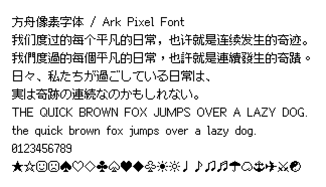

# 方舟像素字体 / Ark Pixel Font

开源的泛中日韩像素字体，黑体风格。

这个项目不仅提供了全部的字形源文件，也提供了构建字体所需要的完整程序。

## 预览

可以通过 [Playground](https://ark-pixel-font.takwolf.com/playground.html) 实时预览字体效果。

### 10 像素

[示例文本](https://ark-pixel-font.takwolf.com/demo-10px.html) · [等宽模式-字母表](https://ark-pixel-font.takwolf.com/alphabet-10px-monospaced.html) · [比例模式-字母表](https://ark-pixel-font.takwolf.com/alphabet-10px-proportional.html)

### 12 像素

[示例文本](https://ark-pixel-font.takwolf.com/demo-12px.html) · [等宽模式-字母表](https://ark-pixel-font.takwolf.com/alphabet-12px-monospaced.html) · [比例模式-字母表](https://ark-pixel-font.takwolf.com/alphabet-12px-proportional.html)

### 16 像素

[示例文本](https://ark-pixel-font.takwolf.com/demo-16px.html) · [等宽模式-字母表](https://ark-pixel-font.takwolf.com/alphabet-16px-monospaced.html) · [比例模式-字母表](https://ark-pixel-font.takwolf.com/alphabet-16px-proportional.html)

## 字符统计

可以通过下面的链接来查看字体各尺寸目前支持的字符情况。

| 尺寸 | 等宽模式 | 比例模式 |
|---|---|---|
| 10px | [info-10px-monospaced](docs/info-10px-monospaced.md) | [info-10px-proportional](docs/info-10px-proportional.md) |
| 12px | [info-12px-monospaced](docs/info-12px-monospaced.md) | [info-12px-proportional](docs/info-12px-proportional.md) |
| 16px | [info-16px-monospaced](docs/info-16px-monospaced.md) | [info-16px-proportional](docs/info-16px-proportional.md) |

## 尺寸

目前支持 10、12 和 16 三个像素尺寸。

字体的 `UPM`（`Units Per Em`，每个字面框包含的设计单位的数量）按照像素尺寸的 100 倍来转化，即：`1 px = 100 units` 。

字体各尺寸的 `UPM` 值如下：

| 尺寸 | UPM |
|---|---|
| 10px | 1000 |
| 12px | 1200 |
| 16px | 1600 |

在渲染时，请将文本尺寸设置为对应字体的像素尺寸或其整数倍，以保证栅格化时能够精确地进行像素转化。

## 宽度模式

目前支持「等宽」和「比例」两种模式。

### 「等宽」模式

字符为全宽或半宽，排版时可严格对其。字形完全处于字面框内部，默认行高等于字体的像素尺寸。

但基线位置略微偏高，中西文混排时西文在视觉上重心偏高，美观性略差。

### 「比例」模式

字符宽度根据字形实际情况变化，基线处于合适的位置。纵向上字形可能会超出字面框，默认行高大于字体的像素尺寸。

该模式排版观感自然，如无特殊需求，你应该优先选择这个模式。

字体各尺寸的默认行高如下：

| 尺寸 | 行高 |
|---|---|
| 10px | 14px |
| 12px | 16px |
| 16px | 22px |

## 语言特定字形

目前支持以下语言特定字形版本：

| 版本 | 含义 | 说明 |
|---|---|---|
| latin | 拉丁语 | 在非中日韩环境下使用，标点符号采用西文习惯写法。 |
| zh_cn | 中文-中国大陆 | 字形采用中国大陆地区标准规范 [《通用规范汉字表》](https://www.moe.gov.cn/jyb_sjzl/ziliao/A19/201306/t20130601_186002.html) 中的写法。 |
| zh_hk | 中文-香港特别行政区 | 字形采用香港地区教育规范 [《常用字字形表》](https://zh.wikipedia.org/wiki/%E5%B8%B8%E7%94%A8%E5%AD%97%E5%AD%97%E5%BD%A2%E8%A1%A8) 中的写法。 |
| zh_tw | 中文-台湾地区 | 字形采用台湾地区教育规范 [《国字标准字体》](https://zh.wikipedia.org/wiki/%E5%9C%8B%E5%AD%97%E6%A8%99%E6%BA%96%E5%AD%97%E9%AB%94) 中的写法。 |
| zh_tr | 中文-传统印刷 | 字形采用 [「传统印刷体」](https://zh.wikipedia.org/wiki/%E8%88%8A%E5%AD%97%E5%BD%A2) 写法，符合香港和台湾地区传统使用习惯。 |
| ja | 日语 | 字形采用日本参考规范 [《常用汉字表》](https://zh.wikipedia.org/wiki/%E5%B8%B8%E7%94%A8%E6%BC%A2%E5%AD%97) 中的写法。 |
| ko | 朝鲜语 | |

## 字形依赖

- [像素字形 - 谚文音节](https://github.com/TakWolf/pixel-glyphs-hangul-syllables)
- [像素字形 - 盲文图案](https://github.com/TakWolf/pixel-glyphs-braille-patterns)

## 程序依赖

- [Pixel Font Builder](https://github.com/TakWolf/pixel-font-builder)
- [Pixel Font Knife](https://github.com/TakWolf/pixel-font-knife)
- [Unidata Blocks](https://github.com/TakWolf/unidata-blocks)
- [Character Encoding Utils](https://github.com/TakWolf/character-encoding-utils)
- [PyYAML](https://github.com/yaml/pyyaml)
- [Pillow](https://github.com/python-pillow/Pillow)
- [Beautiful Soup](https://www.crummy.com/software/BeautifulSoup/)
- [Jinja](https://github.com/pallets/jinja)
- [Loguru](https://github.com/Delgan/loguru)
- [Cyclopts](https://github.com/BrianPugh/cyclopts)

## 外部工具

- [SYMBL](https://symbl.cc)
- [字嗨 - 漢字檢索](https://zi-hi.com/sp/uni/CJKSeeker)
- [字統网](https://zi.tools)
- [汉语国学 - 汉语字典在线查字](https://www.hanyuguoxue.com)
- [思源映射查看器](https://source-han-mapping-viewer.takwolf.com)

## 参考资料

- [Writing Systems Technical Resources](https://writingsystems.info)
- [Microsoft - OpenType Specification](https://learn.microsoft.com/en-us/typography/opentype/spec/)
- [Glyphs 学习 - 纵向量度值](https://glyphsapp.com/zh/learn/vertical-metrics)
- [Glyphs 学习 - 完美像素适配](https://glyphsapp.com/zh/learn/pixel-perfection)
- [FreeType Glyph Conventions](https://freetype.org/freetype2/docs/glyphs/index.html)

## 官方社区

- [「像素字体工房」Discord 服务器](https://discord.gg/3GKtPKtjdU)
- [「像素字体工房」QQ 群](https://qm.qq.com/q/jPk8sSitUI)

## 许可证

分为「字体」和「构建程序」两个部分。

### 字体

使用 [「SIL 开放字体许可证第 1.1 版」](LICENSE-OFL) 授权，保留字体名称「方舟像素 / Ark Pixel」。

### 构建程序

使用 [「MIT 许可证」](LICENSE-MIT) 授权。

## 赞助

如果这个项目对您有帮助，请考虑赞助来支持开发工作。

[赞助商名单](https://github.com/TakWolf/TakWolf/blob/master/sponsors.md)
